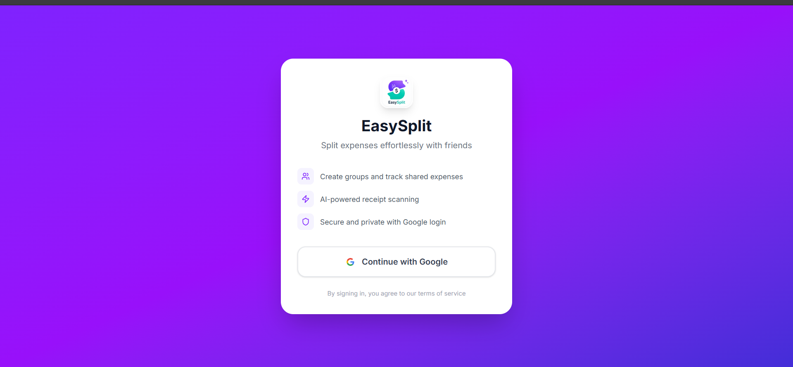
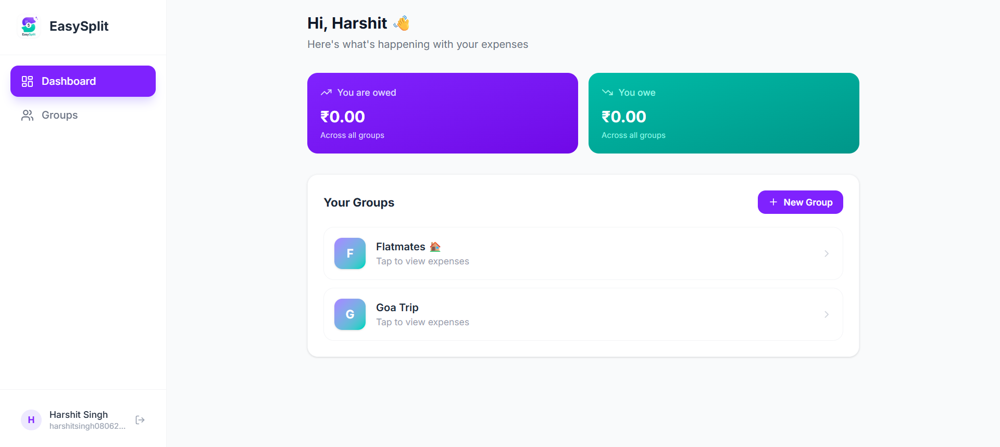
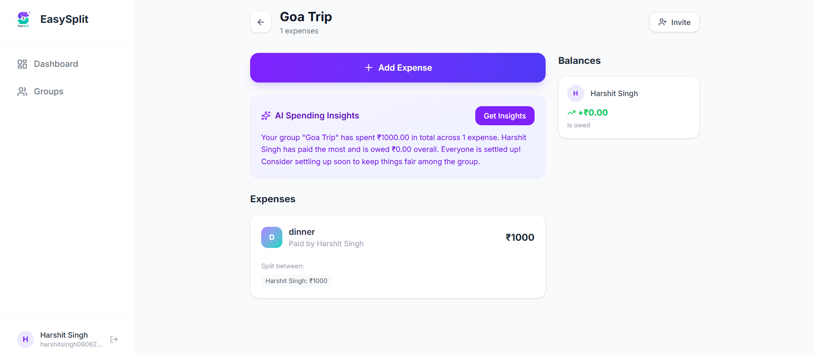

# EasySplit 💸

A full-stack expense-splitting web application that makes splitting bills with friends effortless.

🔗 **Live Demo**: [easysplit-virid.vercel.app](https://easysplit-virid.vercel.app)

---

## ✨ Features

- **Google OAuth Authentication** — Secure sign-in with Google
- **Group Management** — Create groups for trips, flatmates, events, and more
- **Custom Expense Splits** — Split expenses in any amount between group members
- **Real-time Balance Tracking** — See exactly who owes who at a glance
- **AI Spending Insights** — Get natural language summaries of your group's spending patterns
- **AI Receipt Scanner** — Upload a receipt photo to auto-fill expense details
- **Invite System** — Share a link to invite friends directly into your group
- **Responsive Design** — Works beautifully on both desktop and mobile

---

## 🛠️ Tech Stack

| Technology | Usage |
|------------|-------|
| React.js + Vite | Frontend framework |
| Tailwind CSS | Styling |
| Framer Motion | Animations |
| Supabase | PostgreSQL database + Auth |
| Row-Level Security | Per-user data privacy |
| Google OAuth 2.0 | Authentication |
| Vercel | Deployment + CI/CD |

---

## 📸 Screenshots

### Login Page


### Dashboard


### Group Detail


### Add Expense


---

## 🗄️ Database Schema
profiles — User display info (name, avatar)
groups — Expense groups (trips, flatmates, etc.)
group_members — Many-to-many: users ↔ groups
expenses — Individual expense records
expense_splits — Custom split amounts per person per expense
invites — Shareable invite tokens per group
---

## 🔒 Security

- Row-Level Security (RLS) enforced on all database tables
- Users can only access groups they are members of
- Environment variables used for all sensitive credentials
- Google OAuth 2.0 for secure authentication

---

## 🚀 Getting Started

### Prerequisites
- Node.js v18+
- A Supabase account
- A Google Cloud Console project with OAuth credentials

### Installation

1. Clone the repository
```bash
git clone https://github.com/harshit0068/easysplit.git
cd easysplit
```

2. Install dependencies
```bash
npm install
```

3. Create a `.env` file in the root directory
```env
VITE_SUPABASE_URL=your_supabase_url
VITE_SUPABASE_ANON_KEY=your_supabase_anon_key
```

4. Run the development server
```bash
npm run dev
```

5. Open [http://localhost:5173](http://localhost:5173) in your browser

---

## 🌐 Deployment

This project is deployed on **Vercel** with automatic CI/CD — every push to the `master` branch triggers a new deployment automatically.

---

## 🤖 AI Features

### Spending Insights
Analyzes your group's expense data and generates a natural language summary including total spending, top payer, and who owes the most.

### Receipt Scanner
Upload a photo of any receipt and the AI automatically extracts the description and total amount, saving you time when logging expenses.

---

## 📝 Environment Variables

| Variable | Description |
|----------|-------------|
| `VITE_SUPABASE_URL` | Your Supabase project URL |
| `VITE_SUPABASE_ANON_KEY` | Your Supabase publishable/anon key |

---

## 👨‍💻 Author

**Harshit Singh**
- GitHub: [@harshit0068](https://github.com/harshit0068)

---

## 📄 License

This project is open source and available under the [MIT License](LICENSE).